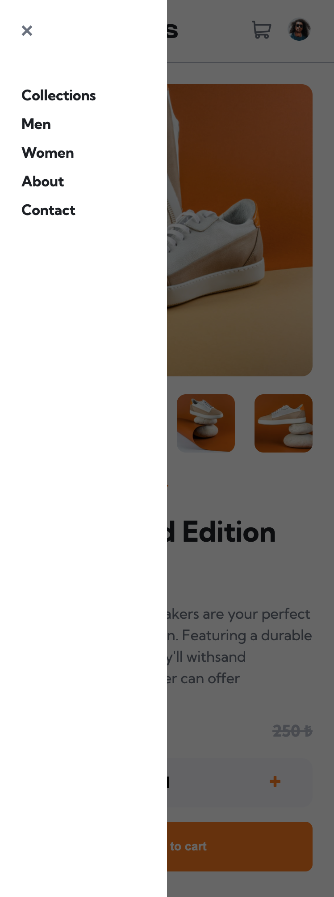

## E-commerce product page

I developed product detail page using javascript and scss with lightbox product gallery and shopping cart functions

### Screenshot

#### Desktop

#### Mobile

<table>
  <tr>
    <td valign="top">
        
    </td>
     <td valign="top">
        
    </td>
     <td valign="top">
        
    </td>
  </tr>
</table>

### Links

- [Github repo](https://github.com/ibrahimgediktr/ecommerce-product-page)
- [Live Site URL](https://e-commerce-product-page-ac818b.netlify.app/)

### Built with

- JQuery
- SCSS

